# Avazu Click Through Rate Prediction
NPC  

## Cleanup data

```r
source("Click_through.R")
train_set = read_data('train',limit=1000)
```
### Proof that data comes from two independent sources website and application
Data is much easier to process if we split it in to two smaller group.  

> **Hypothesis:** We assume that ads from website and application have their own behaviour.  
We can create two models based on different datasources independently.  


```r
proof_split_site_app_domain(train_set)
remove(train_set)
```

### determine RARE level
To reduce complexity of data, We should separate low occurrence and call them "RARE".
We can still observe "RARE" data if it affects CTR model.
This model counts population of each column. If it less than 1%

> **Hypothesis:** We count population of each column. We assume it is rare if the count is less than 1%.


```r
train_web_set = read_data('train',data_source="web", limit=1000)
train_app_set = read_data('train',data_source="app", limit=1000)
```


```r
m_web = train_model_intersect_prob(train_web_set)
m_app = train_model_intersect_prob(train_app_set)
remove(train_web_set)
remove(train_app_set)
```

### replace rare categories with "RARE"

```r
source("Click_through_cleanup.R")
save_check_source_index(train_app_set)

data_sources = c("web", "app")
data_type    = "train"
replace_list = c("C1","banner_pos","site_category","app_category", 
                 "device_model","device_type","device_conn_type",
                 "C14","C15","C16","C17","C18","C19","C20","C21")

for (data_source in data_sources) {
    for (col in replace_list) {
        cat("Clean", data_type, "set:", data_source, "-", col, "\n")
        clean_rare_category(col, data_type, data_source)
    }
}
```

## Plot and define predictors
We define predictors from clicl index that > 0, that means the feature has click > no-click


### Plot relationship between categories and save score

```r
source("Click_through_plot.R")
```

```
## Loading required package: data.table
## Loading required package: lattice
## Loading required package: ggplot2
```

```r
plot_category_relation(data_source="web")
```

```
## [1] "C1 - site_category"
## Read [1] "clean/col_train_web_site_category.RData"
## [1] 25297228
## Read [1] "clean/col_train_web_C1.RData"
## [1] 25297228
## Read [1] "clean/col_train_web_click.RData"
## [1] 25297228
## [1] "Cal aggregate"
## [1] "Prepare for plotting"
```

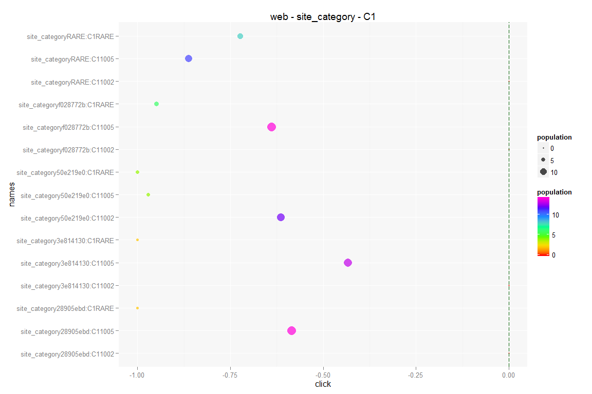 

```
## [1] "C15 - site_category"
## Read [1] "clean/col_train_web_site_category.RData"
## [1] 25297228
## Read [1] "clean/col_train_web_C15.RData"
## [1] 25297228
## Read [1] "clean/col_train_web_click.RData"
## [1] 25297228
## [1] "Cal aggregate"
## [1] "Prepare for plotting"
```

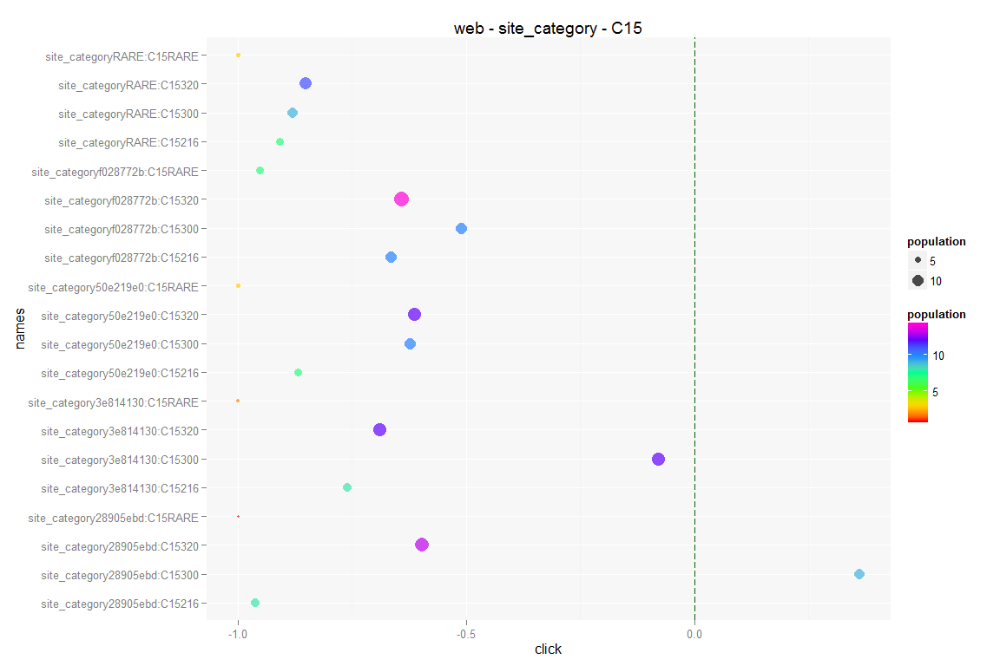 

```
## [1] "C16 - site_category"
## Read [1] "clean/col_train_web_site_category.RData"
## [1] 25297228
## Read [1] "clean/col_train_web_C16.RData"
## [1] 25297228
## Read [1] "clean/col_train_web_click.RData"
## [1] 25297228
## [1] "Cal aggregate"
## [1] "Prepare for plotting"
```

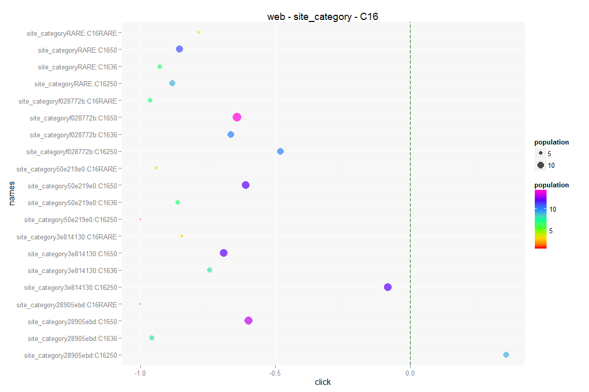 

```
## [1] "C17 - site_category"
## Read [1] "clean/col_train_web_site_category.RData"
## [1] 25297228
## Read [1] "clean/col_train_web_C17.RData"
## [1] 25297228
## Read [1] "clean/col_train_web_click.RData"
## [1] 25297228
## [1] "Cal aggregate"
## [1] "Prepare for plotting"
```

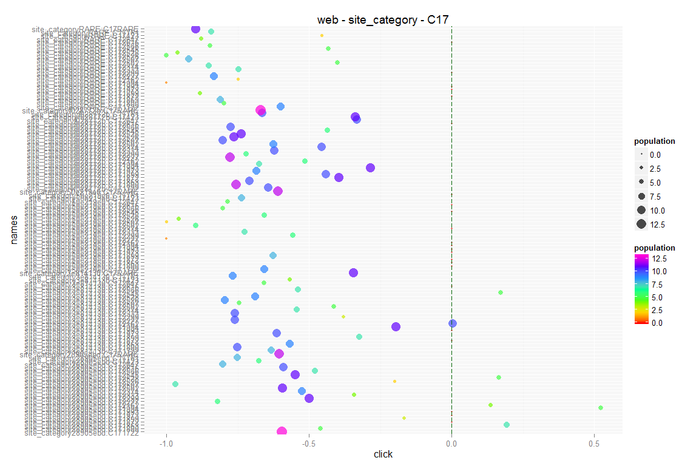 

```
## [1] "C14 - site_category"
## Read [1] "clean/col_train_web_site_category.RData"
## [1] 25297228
## Read [1] "clean/col_train_web_C14.RData"
## [1] 25297228
## Read [1] "clean/col_train_web_click.RData"
## [1] 25297228
## [1] "Cal aggregate"
## [1] "Prepare for plotting"
```

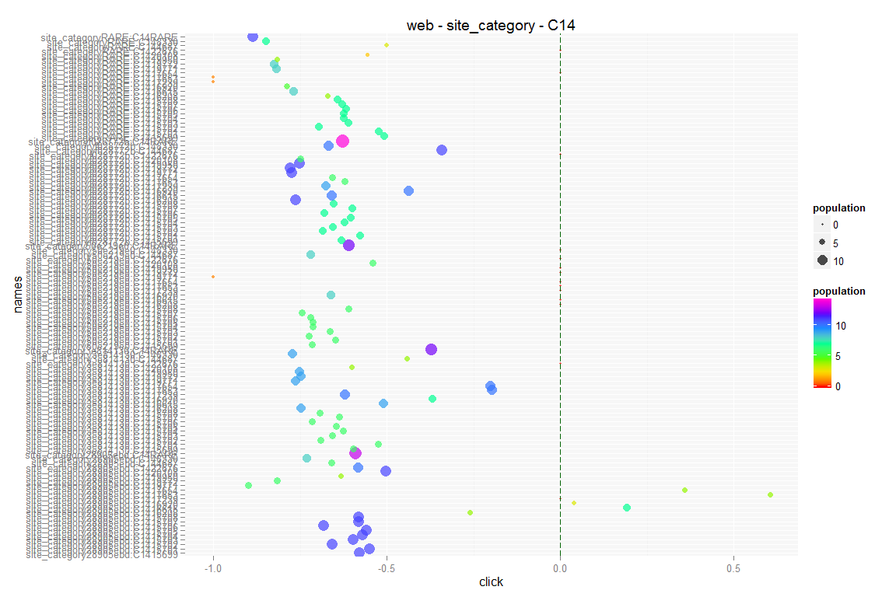 

```
## [1] "C18 - site_category"
## Read [1] "clean/col_train_web_site_category.RData"
## [1] 25297228
## Read [1] "clean/col_train_web_C18.RData"
## [1] 25297228
## Read [1] "clean/col_train_web_click.RData"
## [1] 25297228
## [1] "Cal aggregate"
## [1] "Prepare for plotting"
```

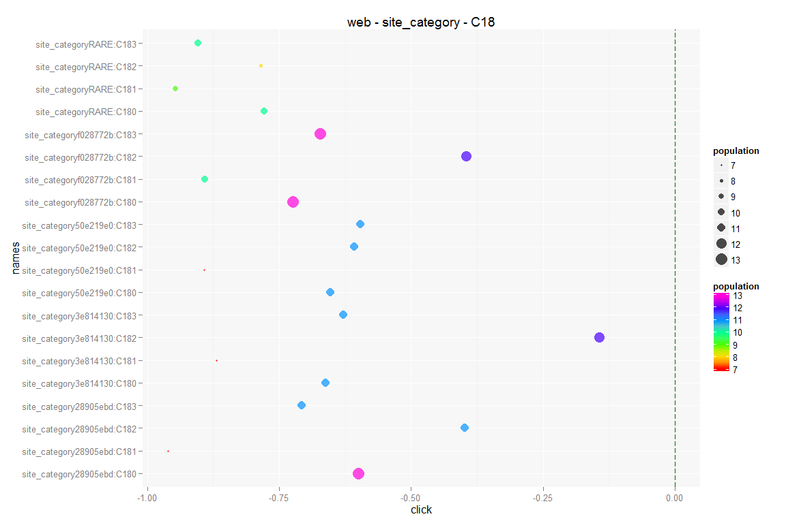 

```
## [1] "C19 - site_category"
## Read [1] "clean/col_train_web_site_category.RData"
## [1] 25297228
## Read [1] "clean/col_train_web_C19.RData"
## [1] 25297228
## Read [1] "clean/col_train_web_click.RData"
## [1] 25297228
## [1] "Cal aggregate"
## [1] "Prepare for plotting"
```

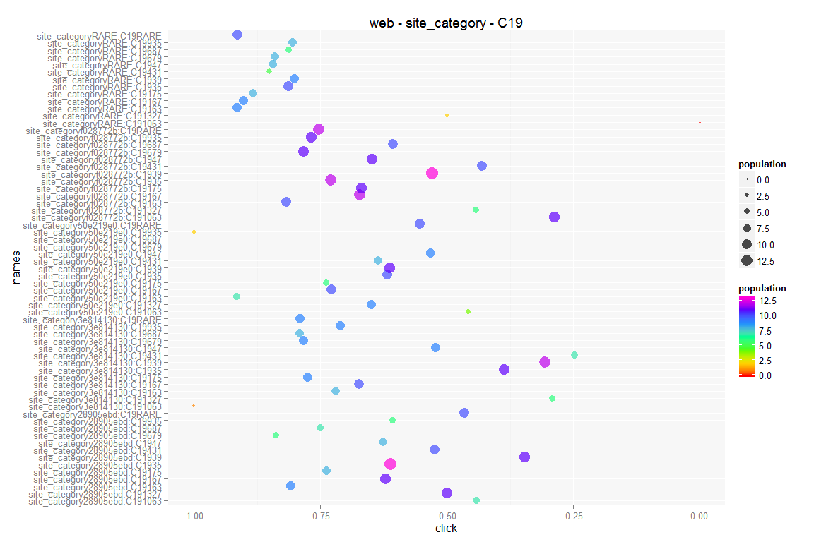 

```
## [1] "C20 - site_category"
## Read [1] "clean/col_train_web_site_category.RData"
## [1] 25297228
## Read [1] "clean/col_train_web_C20.RData"
## [1] 25297228
## Read [1] "clean/col_train_web_click.RData"
## [1] 25297228
## [1] "Cal aggregate"
## [1] "Prepare for plotting"
```

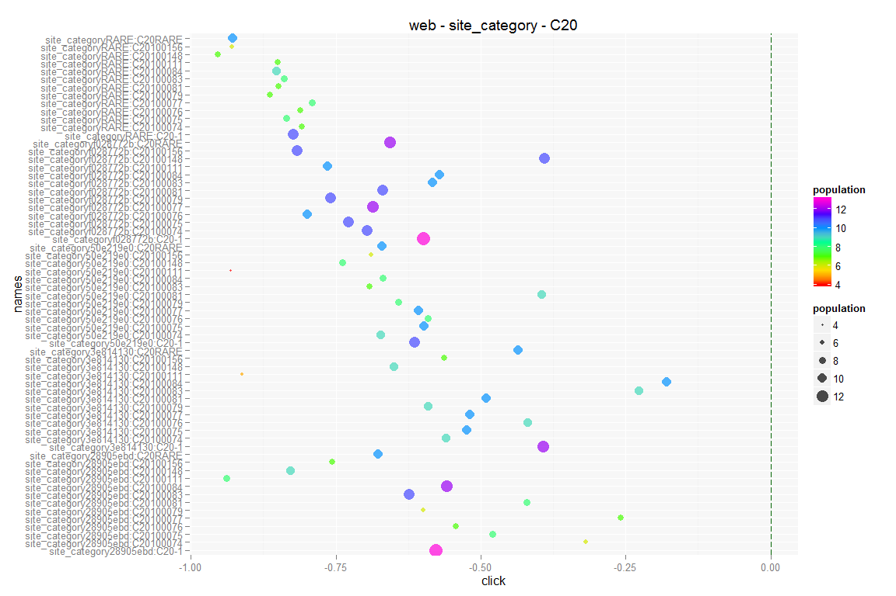 

```
## [1] "C21 - site_category"
## Read [1] "clean/col_train_web_site_category.RData"
## [1] 25297228
## Read [1] "clean/col_train_web_C21.RData"
## [1] 25297228
## Read [1] "clean/col_train_web_click.RData"
## [1] 25297228
## [1] "Cal aggregate"
## [1] "Prepare for plotting"
```

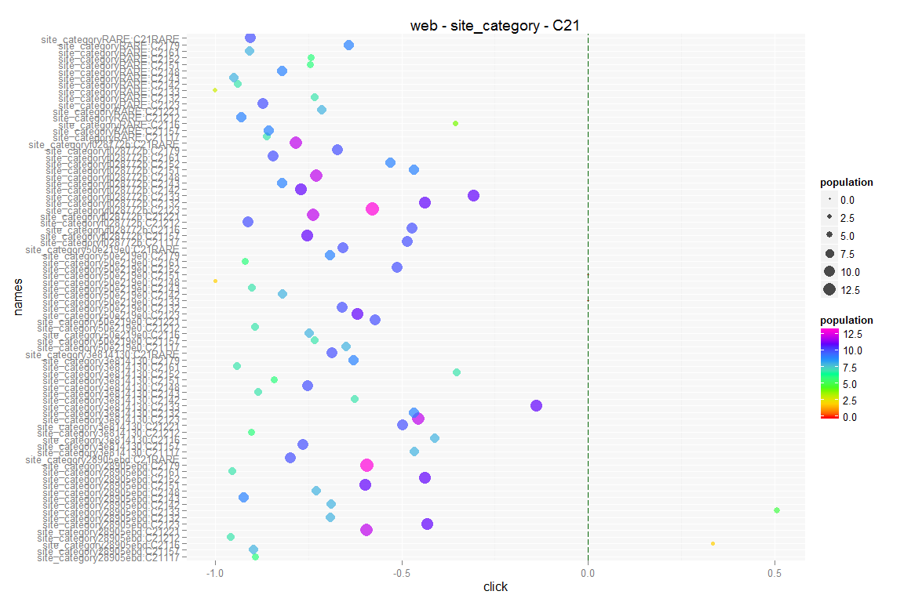 

```
## [1] 1
```

```r
plot_category_relation(data_source="app")
```

```
## [1] "C1 - app_category"
## Read [1] "clean/col_train_app_app_category.RData"
## [1] 15131739
## Read [1] "clean/col_train_app_C1.RData"
## [1] 15131739
## Read [1] "clean/col_train_app_click.RData"
## [1] 15131739
## [1] "Cal aggregate"
## [1] "Prepare for plotting"
```

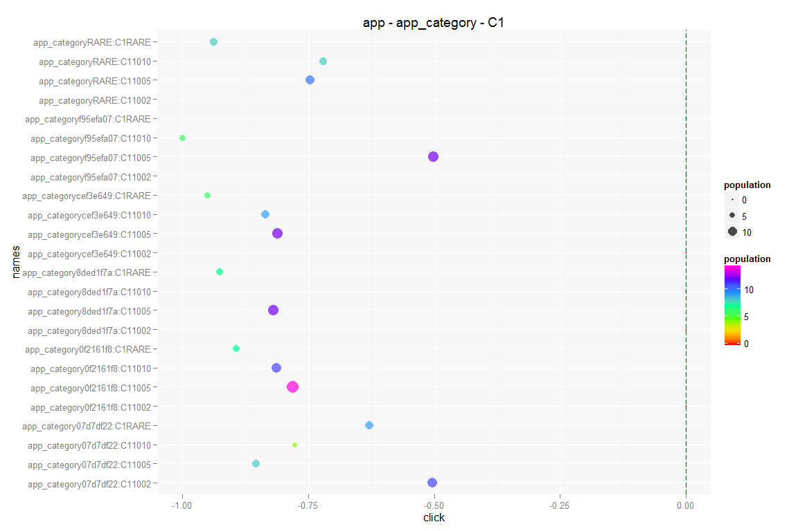 

```
## [1] "C15 - app_category"
## Read [1] "clean/col_train_app_app_category.RData"
## [1] 15131739
## Read [1] "clean/col_train_app_C15.RData"
## [1] 15131739
## Read [1] "clean/col_train_app_click.RData"
## [1] 15131739
## [1] "Cal aggregate"
## [1] "Prepare for plotting"
```

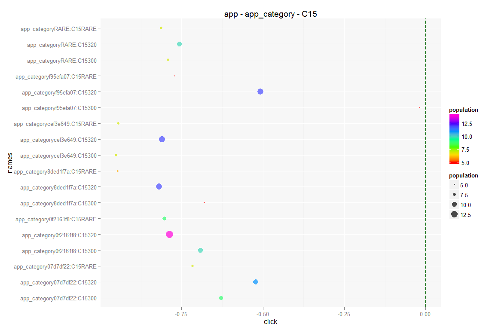 

```
## [1] "C16 - app_category"
## Read [1] "clean/col_train_app_app_category.RData"
## [1] 15131739
## Read [1] "clean/col_train_app_C16.RData"
## [1] 15131739
## Read [1] "clean/col_train_app_click.RData"
## [1] 15131739
## [1] "Cal aggregate"
## [1] "Prepare for plotting"
```

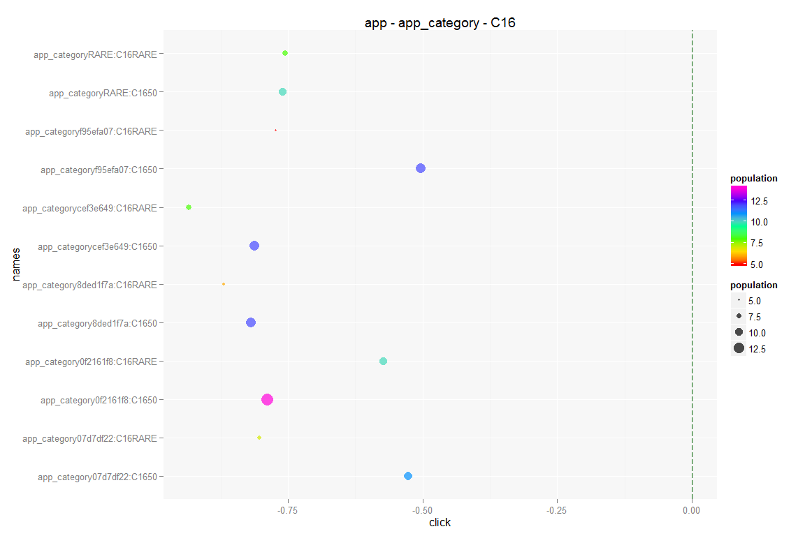 

```
## [1] "C17 - app_category"
## Read [1] "clean/col_train_app_app_category.RData"
## [1] 15131739
## Read [1] "clean/col_train_app_C17.RData"
## [1] 15131739
## Read [1] "clean/col_train_app_click.RData"
## [1] 15131739
## [1] "Cal aggregate"
## [1] "Prepare for plotting"
```

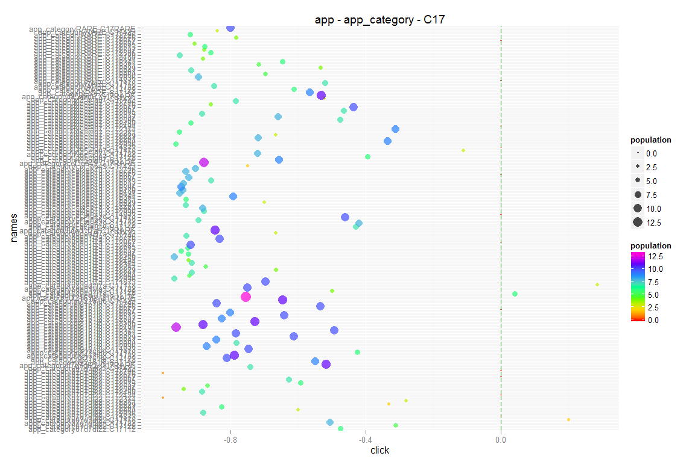 

```
## [1] "C14 - app_category"
## Read [1] "clean/col_train_app_app_category.RData"
## [1] 15131739
## Read [1] "clean/col_train_app_C14.RData"
## [1] 15131739
## Read [1] "clean/col_train_app_click.RData"
## [1] 15131739
## [1] "Cal aggregate"
## [1] "Prepare for plotting"
```

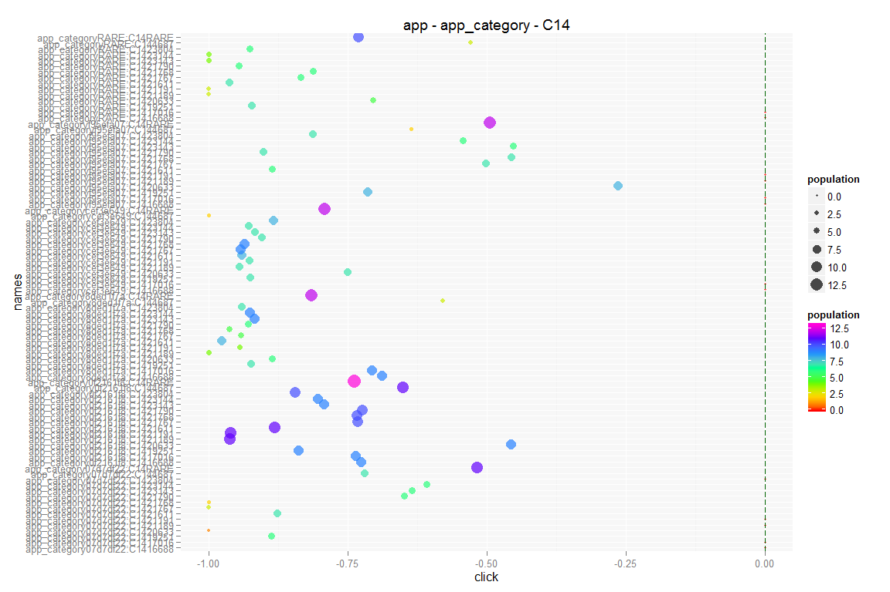 

```
## [1] "C18 - app_category"
## Read [1] "clean/col_train_app_app_category.RData"
## [1] 15131739
## Read [1] "clean/col_train_app_C18.RData"
## [1] 15131739
## Read [1] "clean/col_train_app_click.RData"
## [1] 15131739
## [1] "Cal aggregate"
## [1] "Prepare for plotting"
```

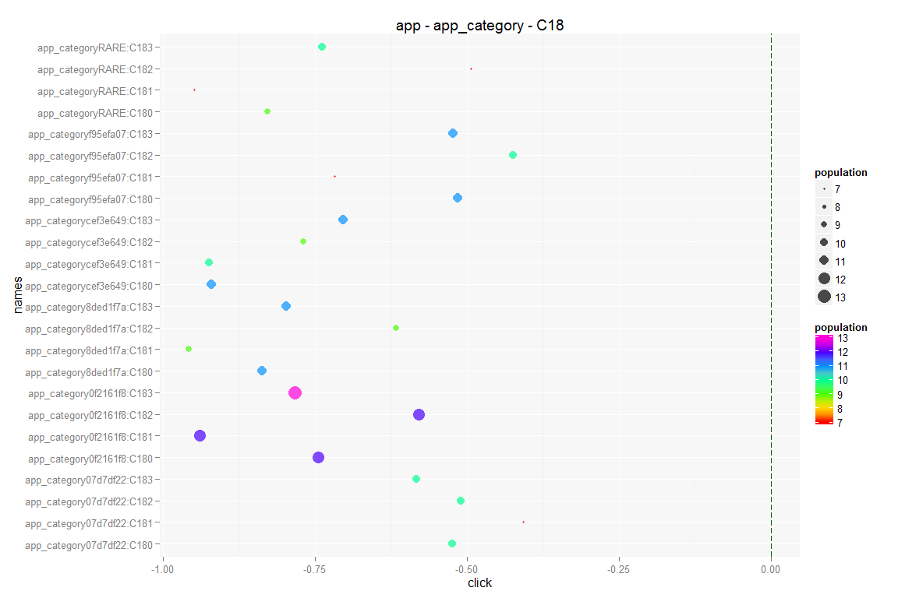 

```
## [1] "C19 - app_category"
## Read [1] "clean/col_train_app_app_category.RData"
## [1] 15131739
## Read [1] "clean/col_train_app_C19.RData"
## [1] 15131739
## Read [1] "clean/col_train_app_click.RData"
## [1] 15131739
## [1] "Cal aggregate"
## [1] "Prepare for plotting"
```

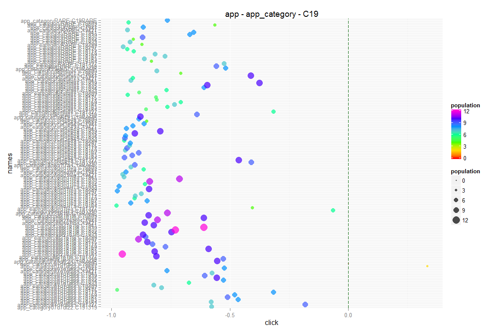 

```
## [1] "C20 - app_category"
## Read [1] "clean/col_train_app_app_category.RData"
## [1] 15131739
## Read [1] "clean/col_train_app_C20.RData"
## [1] 15131739
## Read [1] "clean/col_train_app_click.RData"
## [1] 15131739
## [1] "Cal aggregate"
## [1] "Prepare for plotting"
```

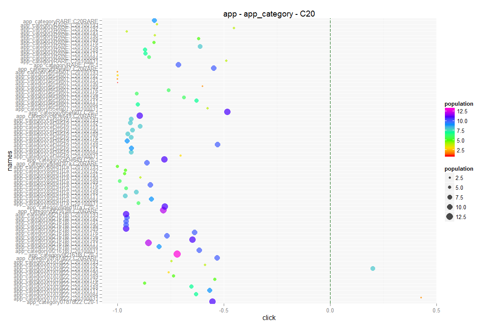 

```
## [1] "C21 - app_category"
## Read [1] "clean/col_train_app_app_category.RData"
## [1] 15131739
## Read [1] "clean/col_train_app_C21.RData"
## [1] 15131739
## Read [1] "clean/col_train_app_click.RData"
## [1] 15131739
## [1] "Cal aggregate"
## [1] "Prepare for plotting"
```

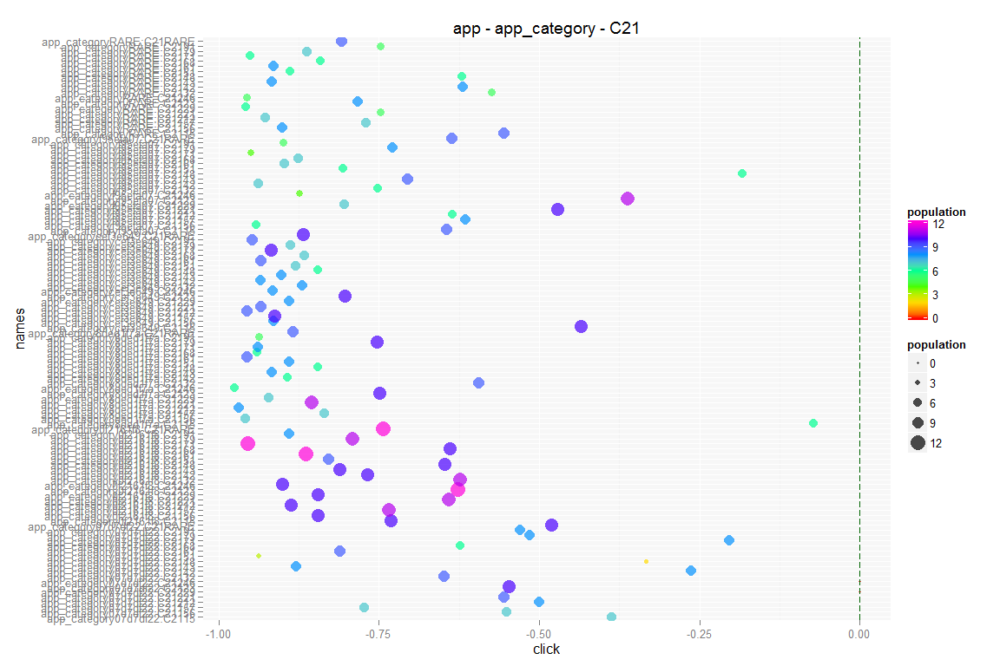 

```
## [1] 1
```

### Plot relationship between banners and save score

improvement increase sampling for relationship data. 
If use 100% of training set, memory overflow.

```r
plot_banner_misc(data_source="web")
```

```
## [1] "device_model - banner_pos"
## Read [1] "clean/col_train_web_banner_pos.RData"
## [1] 25297228
## Read [1] "clean/col_train_web_device_model.RData"
## [1] 25297228
## Read [1] "clean/col_train_web_click.RData"
## [1] 25297228
## [1] "Cal aggregate"
## [1] "Prepare for plotting"
```

 

```
## [1] 1
```

```r
plot_banner_misc(data_source="app")
```

```
## [1] "device_model - banner_pos"
## Read [1] "clean/col_train_app_banner_pos.RData"
## [1] 15131739
## Read [1] "clean/col_train_app_device_model.RData"
## [1] 15131739
## Read [1] "clean/col_train_app_click.RData"
## [1] 15131739
## [1] "Cal aggregate"
## [1] "Prepare for plotting"
```

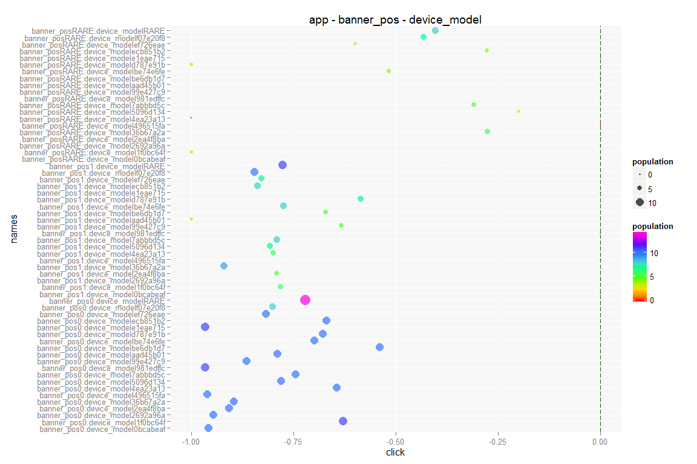 

```
## [1] 1
```

## Create model from predictors

```r
web_combo_list = list(
    c("banner_pos","C1"),
    c("banner_pos","C17"),
    c("device_model","C14"),
    c("device_model","C15"),
    c("device_model","C16"),
    c("device_model","C17"),
    c("device_model","C21"),
    c("site_category","C14"),
    c("site_category","C15"),
    c("site_category","C16"),
    c("site_category","C21")
)

app_combo_list = list(
    c("app_category","C15"),
    c("app_category","C17"),
    c("app_category","C19"),
    c("app_category","C20"),
    c("app_category","C21"),
    c("banner_pos","C1"),
    c("device_type","C20"),
    c("device_model","C17")
)
```

## Train and evaluate model

### Convert raw data into model structure
Set train/test ration to 0.6, separates models between web and app

```r
prep_model_relation_score(data_source="web", train_test_ratio=0.6)
prep_model_relation_score(data_source="app", train_test_ratio=0.6)
```

### Train
, eval=FALSE

```r
model_web = train_model_relation_score(data_source="web")
model_web = train_model_relation_score(data_source="app")
```

### Evaluate model from ROC curve


```
## Type 'citation("pROC")' for a citation.
## 
## Attaching package: 'pROC'
## 
## The following objects are masked from 'package:stats':
## 
##     cov, smooth, var
```

plot ROC for web model

```r
plot(roc_web)
```

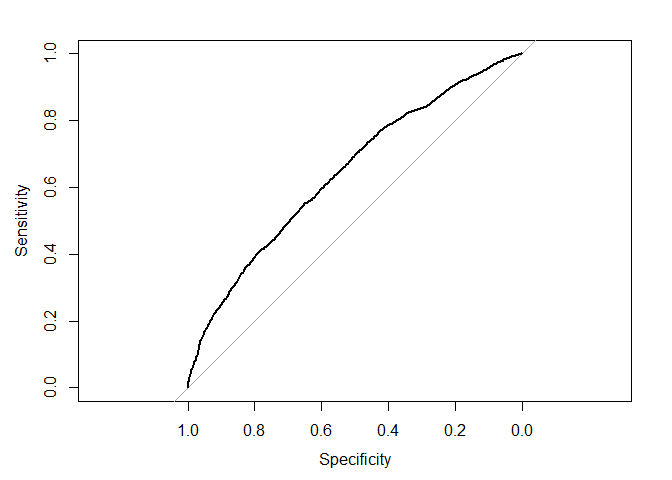 

```
## 
## Call:
## roc.default(response = testing_click, predictor = predictions,     algorithm = 2, plot = T)
## 
## Data: predictions in 8116000 controls (testing_click 0) < 2002891 cases (testing_click 1).
## Area under the curve: 0.6449
```

plot ROC for app model

```r
plot(roc_app)
```

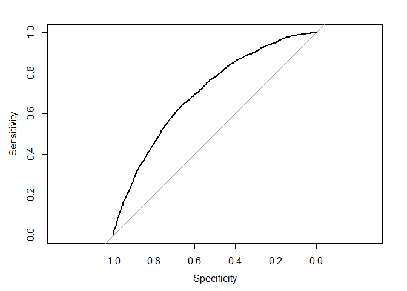 

```
## 
## Call:
## roc.default(response = testing_click, predictor = predictions,     algorithm = 2, plot = T)
## 
## Data: predictions in 5310226 controls (testing_click 0) < 742469 cases (testing_click 1).
## Area under the curve: 0.705
```

## Predict Test set
Prepare test data and save to file

```r
data = prep_model_relation_score(data_source="web", mode="test")
```

Predict and save to file

```r
predict_model_relation_score()
```
